# TechStore - Backend API

## 📋 Mô tả dự án

TechStore là hệ thống backend API RESTful cho một cửa hàng thương mại điện tử chuyên về sản phẩm công nghệ. Dự án được xây dựng với Spring Boot, cung cấp đầy đủ các chức năng quản lý sản phẩm, đơn hàng, khách hàng, khuyến mãi và nhiều tính năng khác.

## 🚀 Công nghệ sử dụng

### Backend Framework & Core
- **Spring Boot 3.5.4** - Framework chính
- **Java 21** - Ngôn ngữ lập trình
- **Spring Data JPA** - ORM và quản lý database
- **Hibernate 6.6.22** - JPA implementation
- **MySQL 8.x** - Cơ sở dữ liệu quan hệ

### Security & Authentication
- **Spring Security** - Bảo mật ứng dụng
- **JWT (JSON Web Token) 0.12.3** - Authentication & Authorization
- **OAuth2 Client** - Đăng nhập qua mạng xã hội
- **BCrypt** - Mã hóa mật khẩu

### Integration & Services
- **Cloudinary** - Lưu trữ và quản lý hình ảnh
- **Spring Mail** - Gửi email xác thực và thông báo
- **SMTP Gmail** - Email service provider

### Development Tools
- **Lombok** - Giảm boilerplate code
- **ModelMapper 3.1.1** - DTO mapping
- **Maven** - Build tool và dependency management
- **Spring Boot DevTools** - Hot reload trong development

### API & Data
- **RESTful API** - Kiến trúc API
- **Bean Validation** - Validation dữ liệu
- **CORS** - Cross-Origin Resource Sharing

## 🏗️ Kiến trúc hệ thống

```
techstore/
├── configurations/      # Cấu hình Spring Security, CORS, Cloudinary, ModelMapper
├── components/          # JWT Token Provider
├── controllers/         # REST API endpoints
│   ├── admin/          # API dành cho Admin
│   ├── customer/       # API dành cho Customer
│   └── ...             # Public APIs
├── dtos/               # Data Transfer Objects
├── exceptions/         # Custom exceptions & Global exception handler
├── filter/             # JWT Authentication Filter
├── models/             # JPA Entities
├── repositories/       # Spring Data JPA Repositories
├── responses/          # Response DTOs
└── services/           # Business logic layer
```

## 📦 Chức năng chính

### 🔐 Xác thực & Phân quyền (Authentication & Authorization)
- Đăng ký tài khoản với xác thực email
- Đăng nhập với JWT Token (Access Token + Refresh Token)
- Refresh token tự động
- Đăng nhập qua mạng xã hội (OAuth2)
- Quên mật khẩu & đặt lại mật khẩu qua email
- Phân quyền ADMIN và CUSTOMER
- HttpOnly Cookie cho Refresh Token (bảo mật)

### 👤 Quản lý tài khoản
- Xem và cập nhật thông tin cá nhân
- Đổi mật khẩu
- Quản lý địa chỉ giao hàng (CRUD)
- Lịch sử đơn hàng


Giao diện người dùng
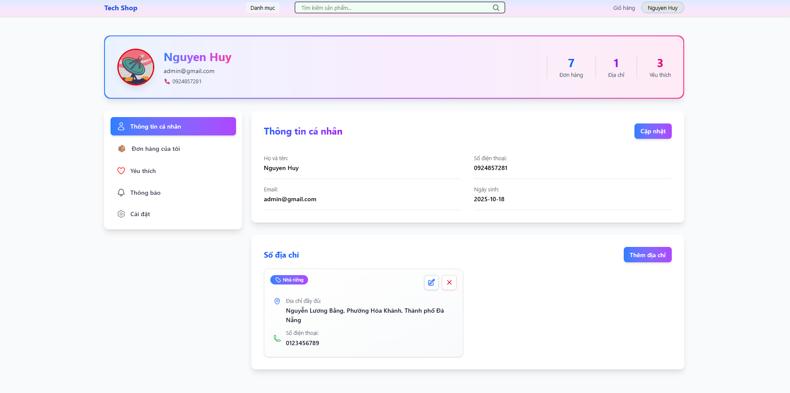

Lịch sử đơn hàng
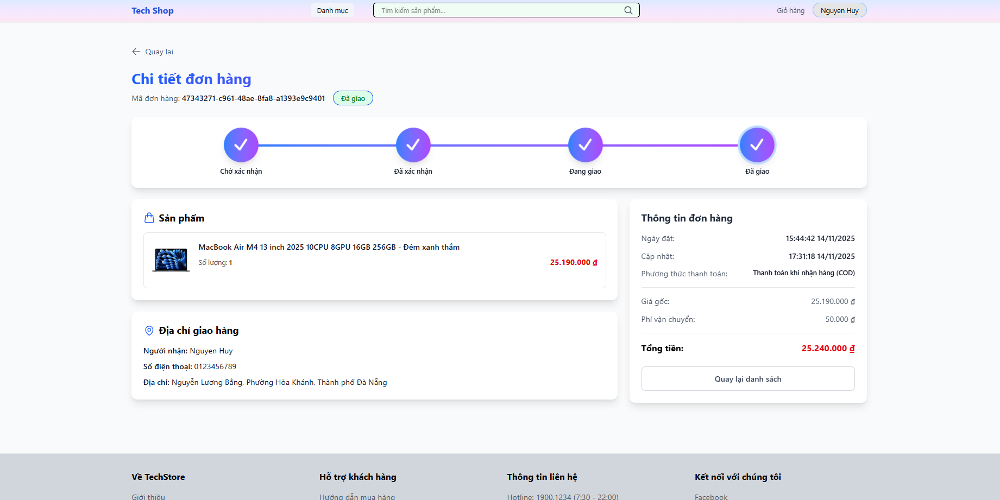


### 📦 Quản lý sản phẩm (Product Management)
- CRUD sản phẩm (Admin)
- Quản lý Product Model (mẫu sản phẩm)
- Quản lý Product Variant (biến thể: màu sắc, dung lượng)
- Quản lý thuộc tính sản phẩm (Attributes)
- Upload nhiều hình ảnh (Cloudinary)
- Quản lý tồn kho (Stock management)
- Tìm kiếm và lọc sản phẩm
- Sản phẩm tương tự theo danh mục

Quản lý nhóm sản phẩm
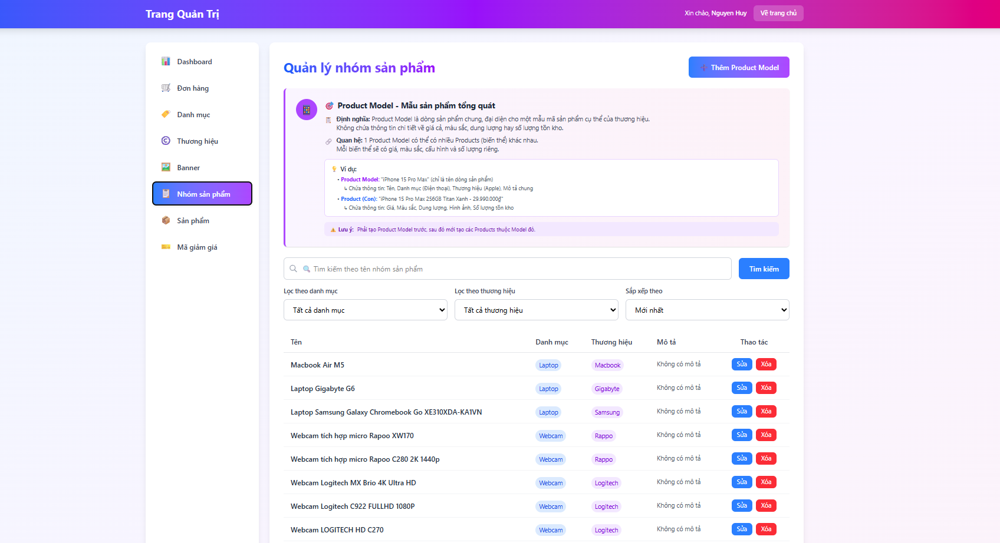

Quản lý sản phẩm
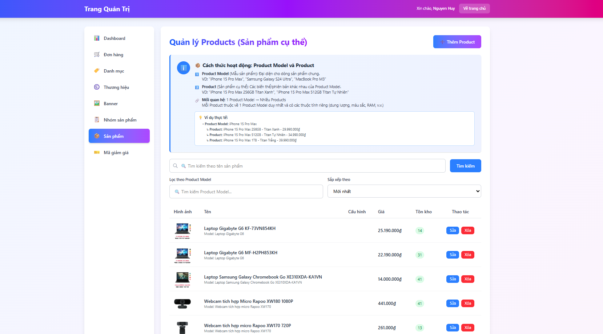

Thêm sản phẩm
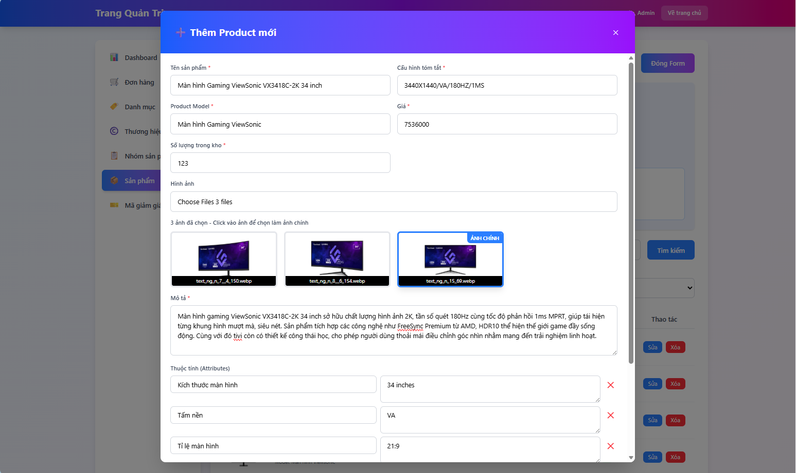

Sửa sản phẩm
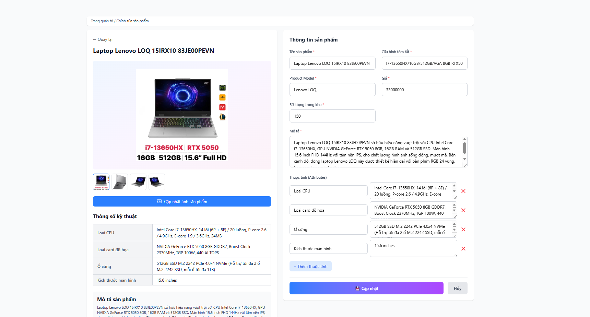

### 🏷️ Quản lý danh mục & thương hiệu
- CRUD Danh mục (Categories)
- CRUD Thương hiệu (Brands) với upload logo
- Phân cấp danh mục

Quản lý thương hiệu
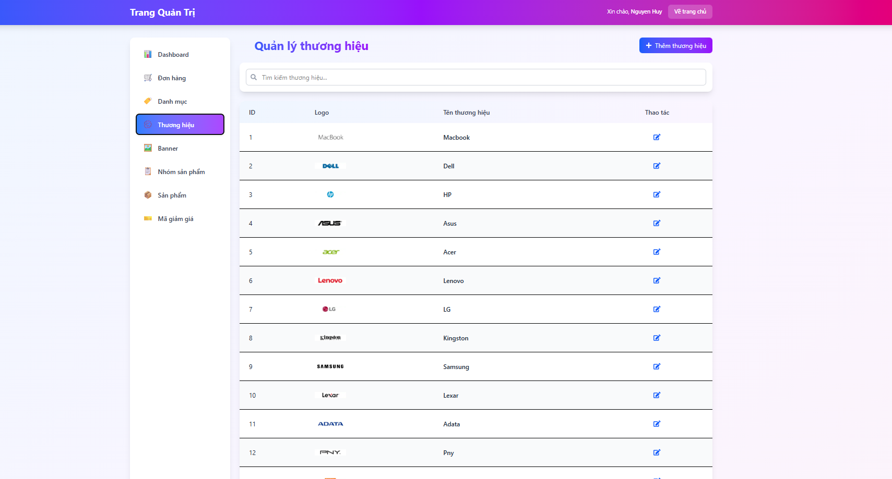

### 🎫 Hệ thống khuyến mãi (Promotion System)
- Tạo và quản lý mã khuyến mãi
- Các loại giảm giá:
  - Giảm giá cố định (FIXED)
  - Giảm giá phần trăm (PERCENTAGE) với giới hạn tối đa
  - Miễn phí vận chuyển (SHIPPING)
- Điều kiện áp dụng:
  - Giá trị đơn hàng tối thiểu
  - Giới hạn số lần sử dụng (tổng & per user)
  - Mã dành cho khách hàng mới
  - Thời gian có hiệu lực
- Validation và tính toán giảm giá tự động
- Tracking usage và refund khi hủy đơn

Quản lý mã giảm giá
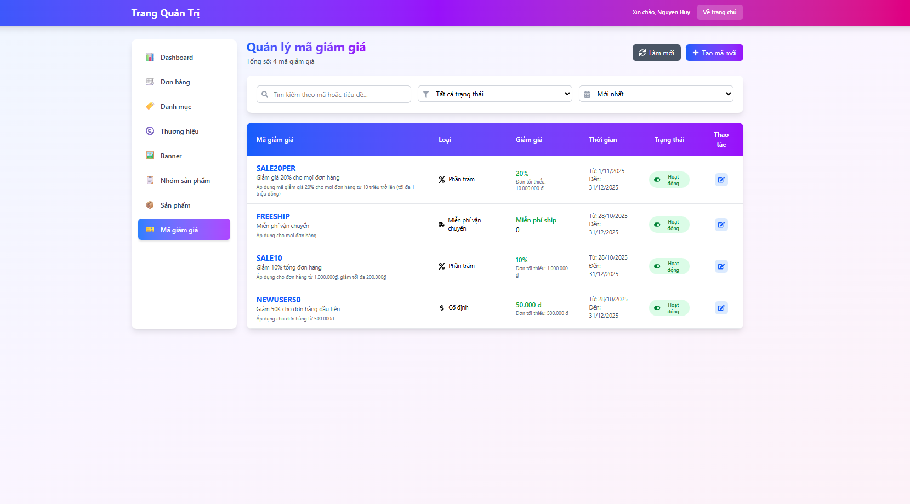

### 🛒 Giỏ hàng (Shopping Cart)
- Thêm/Xóa/Cập nhật sản phẩm vào giỏ
- Hỗ trợ product variant (màu sắc, dung lượng)
- Tự động xóa sản phẩm đã thanh toán khỏi giỏ
- Xử lý chính xác cho multi-variant products

Giỏ hàng
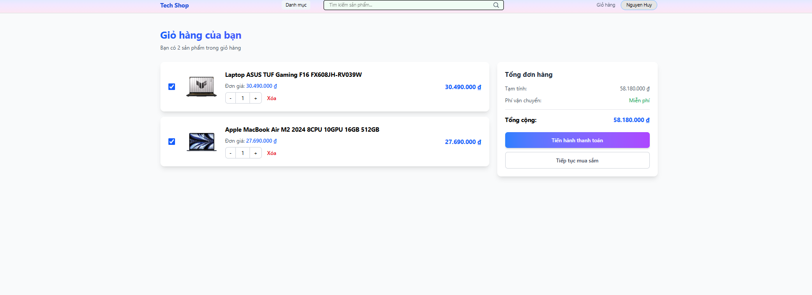

### 📝 Quản lý đơn hàng (Order Management)
- Tạo đơn hàng với validation stock
- Áp dụng mã khuyến mãi
- Quản lý trạng thái đơn hàng:
  - PENDING (Chờ xử lý)
  - CONFIRMED (Đã xác nhận)
  - SHIPPING (Đang giao)
  - DELIVERED (Đã giao)
  - CANCELLED (Đã hủy)
- Hủy đơn hàng với hoàn trả stock tự động
- Hoàn trả promotion usage khi hủy
- Thống kê đơn hàng theo status
- Tìm kiếm và lọc đơn hàng (Admin)
- Chi tiết đơn hàng với OrderItems

Quản lý đơn hàng
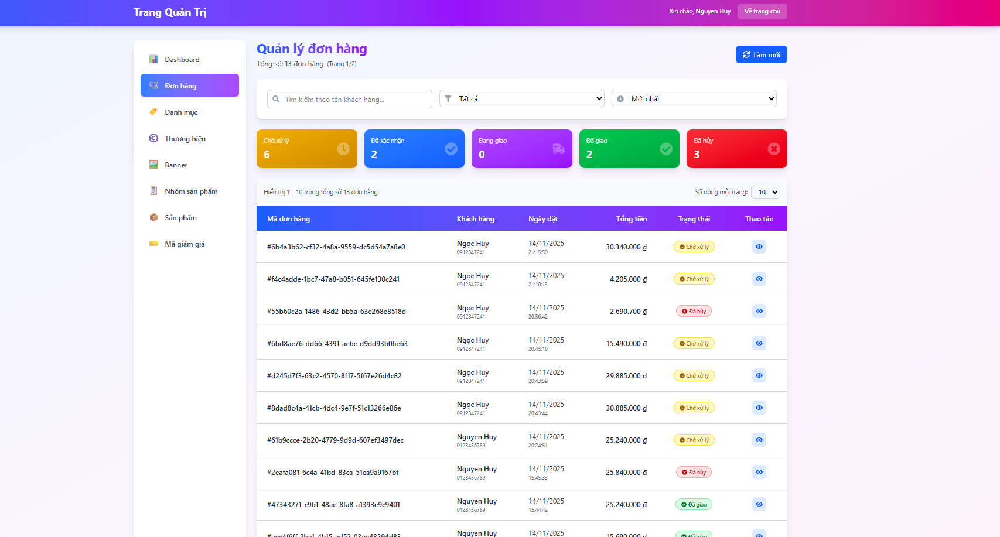

Thanh toán
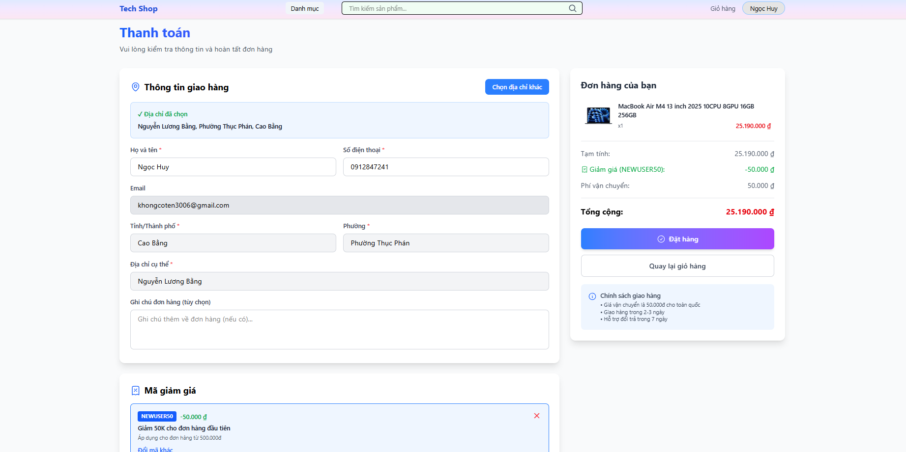

### 🔔 Hệ thống thông báo (Notification System)
- Thông báo tự động khi thay đổi trạng thái đơn hàng
- Đánh dấu đã đọc/chưa đọc
- Lấy danh sách thông báo của user

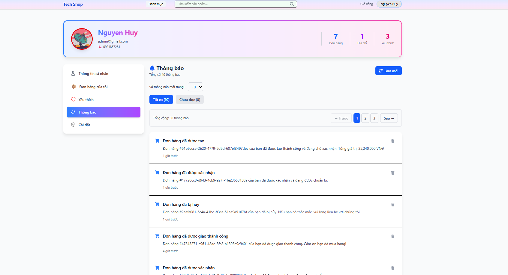

### ⭐ Đánh giá & Review
- Khách hàng đánh giá sản phẩm đã mua
- Rating 1-5 sao
- Hiển thị review theo sản phẩm

Đánh giá sản phẩm
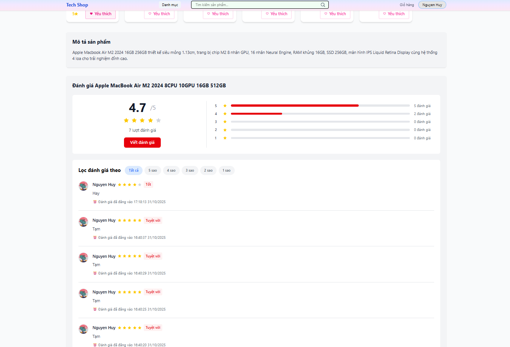


### ❤️ Yêu thích (Favorites/Wishlist)
- Thêm/Xóa sản phẩm yêu thích
- Xem danh sách sản phẩm yêu thích

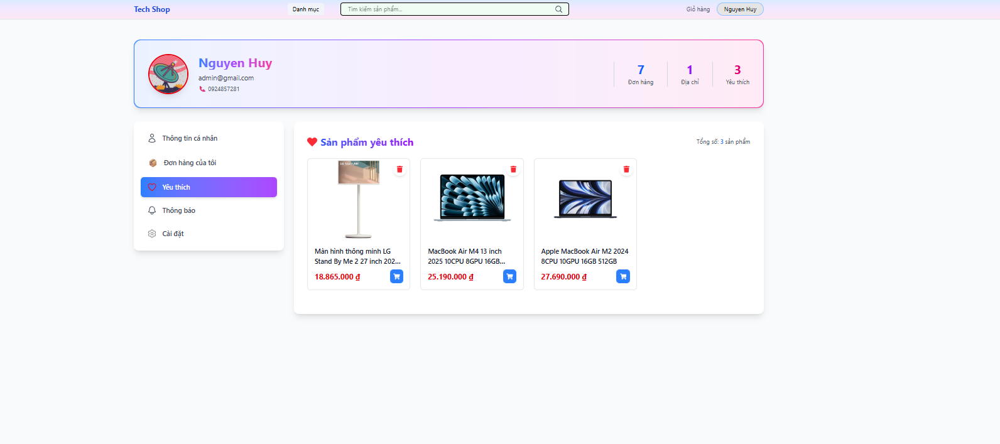

### 🎨 Banner
- Quản lý banner trang chủ
- Upload và quản lý hình ảnh qua Cloudinary
- Tối ưu async upload cho performance

Quản lý banner hiển thị trên trang home
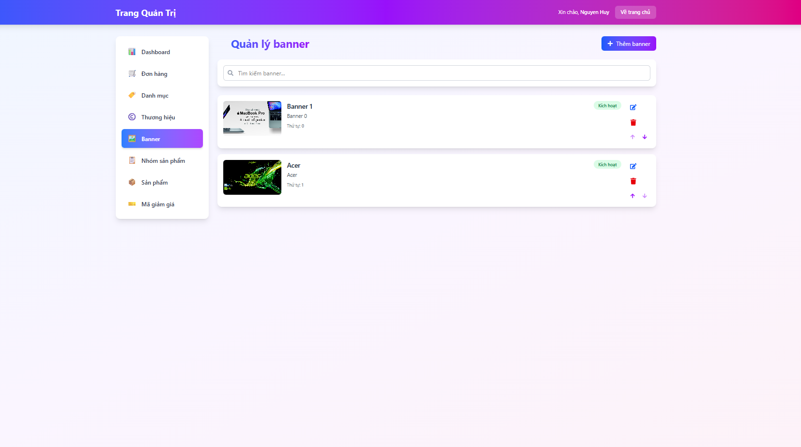


### 📊 Thống kê (Admin Analytics)
- Thống kê đơn hàng theo trạng thái
- Tổng doanh thu
- Doanh thu theo thời gian (ngày, tuần, tháng, năm)
- Top sản phẩm bán chạy
- Số lượng sản phẩm đã bán
- Thống kê sản phẩm theo danh mục
- Cảnh báo sản phẩm sắp hết hàng
- Đơn hàng gần đây

Thống kê
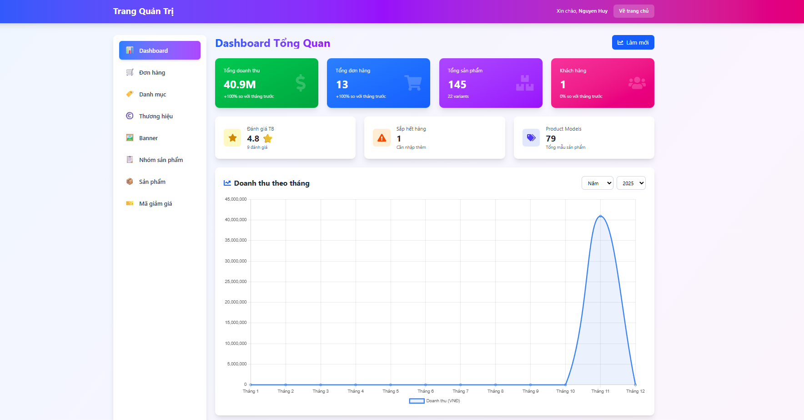

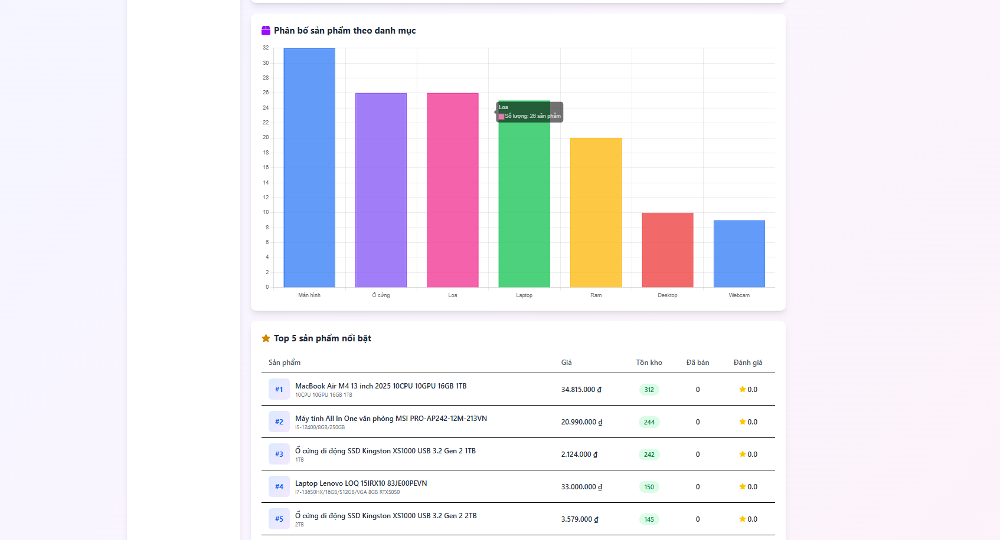

### 📧 Email Service
- Email xác thực tài khoản với HTML template
- Email đặt lại mật khẩu
- Email thông báo đơn hàng
- Token có thời hạn (5 phút)
- Dynamic backend URL detection

## 🗄️ Database Schema (Entities)

- **User** - Người dùng (Customer/Admin)
- **Address** - Địa chỉ giao hàng
- **Category** - Danh mục sản phẩm
- **Brand** - Thương hiệu
- **ProductModel** - Mẫu sản phẩm
- **Product** - Sản phẩm
- **ProductVariant** - Biến thể sản phẩm (màu, dung lượng)
- **Attribute** - Thuộc tính sản phẩm
- **Media** - Hình ảnh/Media files
- **Order** - Đơn hàng
- **OrderItem** - Chi tiết đơn hàng
- **Cart** - Giỏ hàng
- **CartItem** - Sản phẩm trong giỏ
- **Promotion** - Mã khuyến mãi
- **UserPromotionUsage** - Lịch sử sử dụng khuyến mãi
- **Review** - Đánh giá sản phẩm
- **Notification** - Thông báo
- **Favorite** - Sản phẩm yêu thích
- **Banner** - Banner trang chủ
- **Token** - Refresh tokens
- **VerificationToken** - Token xác thực email
- **PasswordResetToken** - Token đặt lại mật khẩu

## 🔧 Cấu hình

### Application Properties (application.yml)

```yaml
spring:
  datasource:
    url: jdbc:mysql://localhost:3306/techstore
    username: root
    password: your_password
  
  jpa:
    hibernate:
      ddl-auto: none
    show-sql: true
  
  mail:
    host: smtp.gmail.com
    port: 587
    username: your_email@gmail.com
    password: your_app_password
  
  security:
    oauth2:
      client:
        registration:
          google:
            client-id: your_google_client_id
            client-secret: your_google_client_secret

cloudinary:
  cloud-name: your_cloud_name
  api-key: your_api_key
  api-secret: your_api_secret

api:
  prefix: /api/v1

app:
  backend-url: http://localhost:8080
  jwt:
    secret: your_jwt_secret_key_at_least_512_bits
    expiration: 86400000  # 24 hours
    expiration-refresh-token: 2592000000  # 30 days
```

## 🚀 Cài đặt và chạy

### Prerequisites
- Java 21 hoặc cao hơn
- MySQL 8.x
- Maven 3.6+
- Cloudinary account
- Gmail account (cho email service)

### Các bước cài đặt

1. **Clone repository**
```bash
git clone <repository-url>
cd techstore
```

2. **Tạo database**
```sql
CREATE DATABASE techstore CHARACTER SET utf8mb4 COLLATE utf8mb4_unicode_ci;
```

3. **Cấu hình application.yml**
   - Cập nhật thông tin database
   - Cấu hình Cloudinary credentials
   - Cấu hình Gmail SMTP
   - Cấu hình JWT secret key

4. **Build project**
```bash
mvn clean install
```

5. **Run application**
```bash
mvn spring-boot:run
```

Hoặc chạy file JAR:
```bash
java -jar target/techstore-0.0.1-SNAPSHOT.jar
```

Application sẽ chạy tại: `http://localhost:8080`

## 📚 API Documentation

### Base URL
```
http://localhost:8080/api/v1
```

### Authentication Headers
```
Authorization: Bearer <access_token>
```

### Main Endpoints

#### Public APIs
- `POST /users/register` - Đăng ký tài khoản
- `POST /users/login` - Đăng nhập
- `POST /users/refresh-token` - Refresh token
- `GET /products/**` - Xem sản phẩm
- `GET /banners` - Xem banners

#### Customer APIs (Requires Authentication)
- `GET /customer/orders/**` - Quản lý đơn hàng
- `POST /customer/orders` - Tạo đơn hàng
- `GET /customer/cart` - Giỏ hàng
- `POST /customer/favorites` - Yêu thích
- `POST /customer/reviews` - Đánh giá

#### Admin APIs (Requires ADMIN Role)
- `POST /admin/products` - Tạo sản phẩm
- `PUT /admin/orders/{id}/confirm` - Xác nhận đơn
- `GET /admin/statistics/**` - Thống kê
- `POST /admin/promotions` - Tạo khuyến mãi

## 🔒 Security Features

- **JWT Authentication** với Access + Refresh Token
- **Password Encryption** với BCrypt
- **CORS Configuration** cho frontend
- **HttpOnly Cookies** cho Refresh Token
- **Email Verification** trước khi kích hoạt tài khoản
- **Role-based Authorization** (ADMIN/CUSTOMER)
- **Transaction Management** cho data integrity
- **SQL Injection Prevention** với JPA Query Parameters

## 🎯 Performance Optimizations

- **Batch Operations** cho việc cập nhật stock
- **Async Image Upload** với CompletableFuture
- **Optimized Queries** với @Query và JPQL
- **Pagination** cho danh sách lớn
- **Database Indexing** trên các trường thường search
- **N+1 Query Prevention** với @EntityGraph
- **Single Query Aggregation** cho statistics

## 👥 Contributors

- Developer: [Your Name]

## 📝 License

This project is licensed under the MIT License.

## 📞 Contact

- GitHub: [\[NguyenVanNgocHuy\]](https://github.com/ngochuytech)

---

**Note**: Đây là project mẫu cho mục đích học tập và demo. Không sử dụng trực tiếp trong production mà không có các biện pháp bảo mật và testing đầy đủ.
